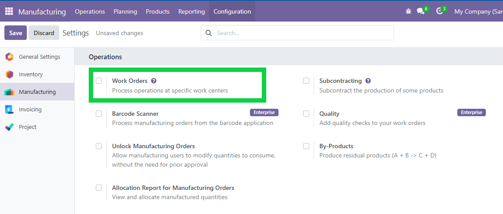
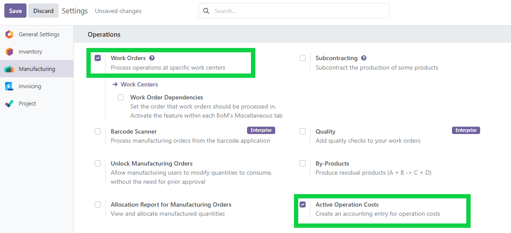

MRP Cost 
========

Este módulo amplía la funcionalidad del módulo ``mrp_account`` de Odoo, crea asiento contable para los costos adicionales de las operaciones en las ordenes de fabricación

Caracteristicas
--------

- 📌 **-**: 
- 👁️ **-**: -
- 🔍 **-**: -

Configuración
----

Para configurar este módulo, dirígete a ``Manufacturing > Configuration > Settings``. Allí, activa la opción ``Work Orders``. Al seleccionarla, se mostrará la casilla ``Active Operation Costs``, la cual también debe estar marcada.

Usage
-----

#. Navigate to *Projects / Tasks*.
#. Use the side menu options to access:
   - *My Tasks*
   - *All Tasks*
   - *User Tasks*
#. In *User Tasks*, select a user from the wizard to see their active tasks.

Screenshots
-----------

**Main Menu**

.. image:: ./static/descripction/mrp_cost/menu.PNG
   :width: 70%
   :align: center

**My Tasks View**

.. image:: ./static/descripction/mrp_cost/view_my_tasks.PNG
   :width: 70%
   :align: center

**All Tasks View**

.. image:: ./static/descripction/mrp_cost/view_all_tasks.PNG
   :width: 70%
   :align: center

**User Tasks View**

.. image:: ./static/descripction/mrp_cost/view_user_tasks.PNG
   :width: 70%
   :align: center

.. image:: ./static/descripction/mrp_cost/selection_user.PNG
   :width: 70%
   :align: center

.. image:: ./static/descripction/mrp_cost/view_user_selection_tasks.PNG
   :width: 70%
   :align: center

Bug Tracker
-----------

Bugs are tracked on `GitHub Issues <https://github.com/TU_REPOSITORIO_GITHUB/issues>`_.
If you find a bug, please report it with detailed steps to reproduce the issue.

Credits
-------

Authors
~~~~~~~

.. image:: https://d-3system.com.au/wp-content/uploads/2020/05/Dimension3_Systems_460x159.png.webp
   :width: 25%
   :alt: Dimension 3 systems
   :target: https://d-3system.com.au/

Contributors
~~~~~~~~~~~~

* Juan Pablo Arcos

Maintainers
~~~~~~~~~~~

This module is maintained by your team or organization.

.. image:: https://d-3system.com.au/wp-content/uploads/2020/05/Dimension3_Systems_460x159.png.webp
   :width: 25%
   :alt: Dimension 3 systems
   :target: https://d-3system.com.au/

License
=======

Licensed under the LGPL v3.0 or later.  
This module is not part of an official OCA repository but follows OCA best development practices.
