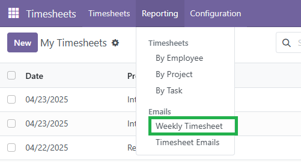
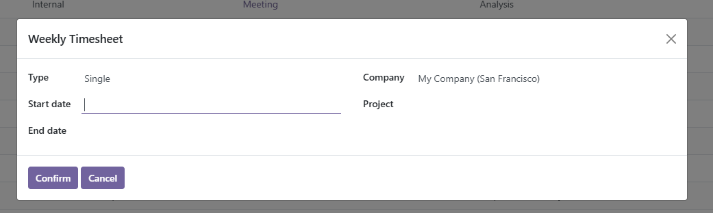
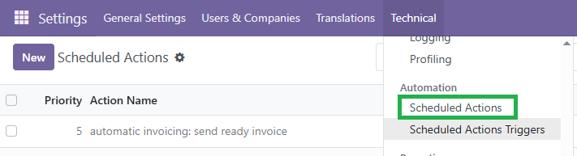

Timesheet User 
==============

This module extends the functionality of Odoo ``hr_timesheet`` modules, allowing the generation and sending of a weekly report to the client with all hours logged on a project during the week. The feature is designed to facilitate transparency and communication with the client regarding the time worked.

Features
========

- Automatic or manual generation of the weekly report.
- Email delivery to the client with the report attached as a PDF.
- Support for multiple projects.
- Custom report design with the project name and timesheet details.

Usage Modes
===========

Manual
------

To generate the report manually:

1. Go to **Timesheets > Reporting > Weekly Timesheet**.
2. A popup window will appear.
3. Select the date range and the project.
4. The system will generate and send the report to the client.

Automatic
---------

To enable weekly automatic generation:

1. Enable **developer (debug) mode**.
2. Go to **Settings > Technical > Automation > Scheduled Actions**.
3. Look for the scheduled action named **"D3 Weekly Timesheet automation"**.
4. Check the **Active** box to enable it.

.. image:: ./static/description/timesheet_user/scheduled_activity.PNG
   :width: 60%
   :align: center

Bug Tracker
-----------
Bugs are tracked on `GitHub Issues <https://github.com/TU_REPOSITORIO_GITHUB/issues>`_.
If you find a bug, please report it with detailed steps to reproduce the issue.

Credits
-------

Authors
~~~~~~~

.. image:: https://d-3system.com.au/wp-content/uploads/2020/05/Dimension3_Systems_460x159.png.webp
   :width: 25%
   :alt: Dimension 3 systems
   :target: https://d-3system.com.au/

Contributors
~~~~~~~~~~~~

* Juan Pablo Arcos

Maintainers
~~~~~~~~~~~

This module is maintained by your team or organization.

.. image:: https://d-3system.com.au/wp-content/uploads/2020/05/Dimension3_Systems_460x159.png.webp
   :width: 25%
   :alt: Dimension 3 systems
   :target: https://d-3system.com.au/

License
=======

Licensed under the LGPL v3.0 or later.  
This module is not part of an official OCA repository but follows OCA best development practices.
