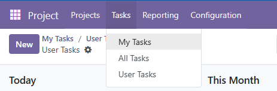
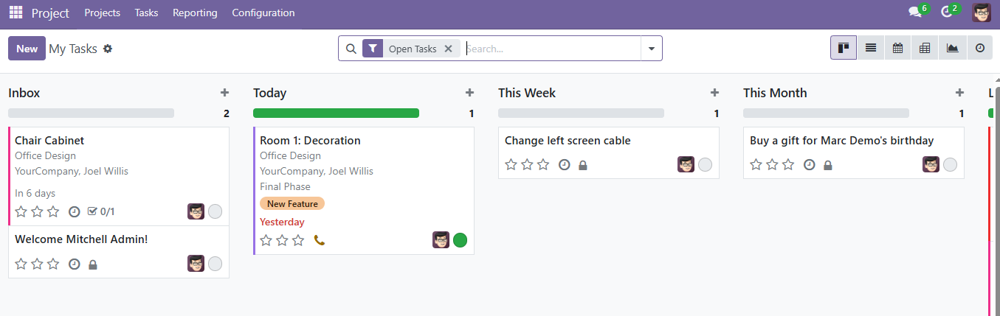
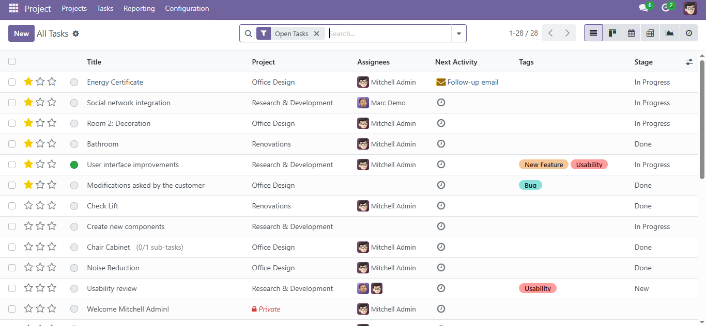
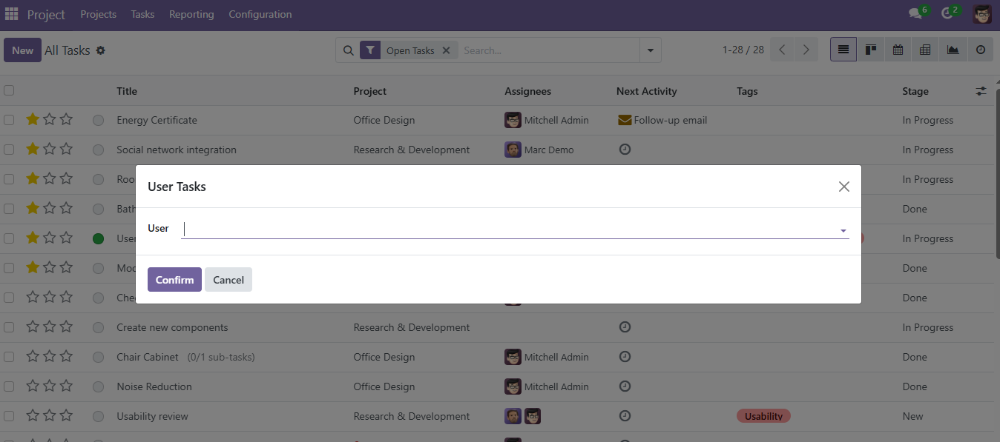
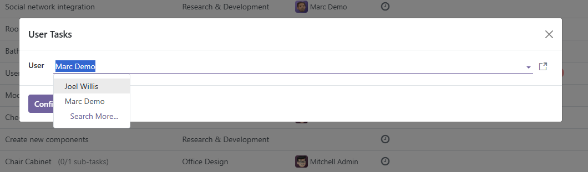
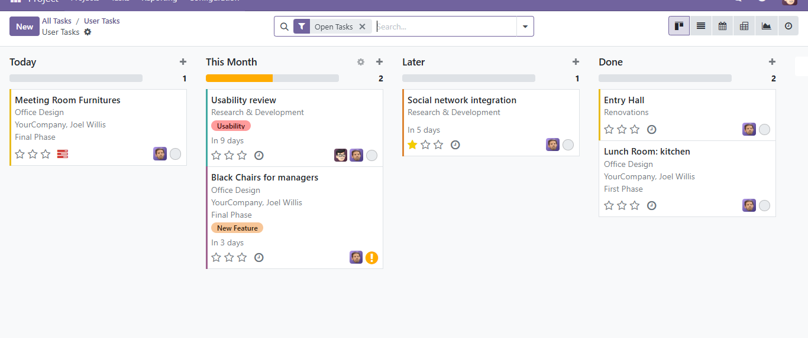

Project Task 
==========================================

Este módulo extiende la funcionalidad del módulo ``project`` de Odoo, agregando un menú personalizado llamado **Tasks** con tres vistas específicas para facilitar la gestión de tareas por parte de usuarios y administradores.

Características
---------------

- 📌 **My Tasks**: Muestra únicamente las tareas asignadas al usuario conectado.
- 👁️ **All Tasks**: Vista disponible solo para administradores. Permite visualizar todas las tareas del sistema, con sus respectivos estados y responsables.
- 🔍 **User Tasks**: Permite seleccionar un usuario específico y visualizar las tareas asignadas, simulando cómo las vería ese usuario.

Menú
----

Este módulo añade un nuevo menú en el sistema:

Uso
---

#. Ir al módulo de *Proyectos / Tareas*.
#. Usar las opciones del menú lateral para acceder a:
   - *Mis Tareas*
   - *Todas las Tareas*
   - *Tareas por Usuario*
#. En *Tareas por Usuario*, seleccionar un usuario desde el asistente para ver sus tareas activas.

Capturas
--------

**Menú principal**

.. image:: ./assets/menu.png
   :width: 80%
   :align: center

**Vista de Mis Tareas**

**Vista de Todas las Tareas**

**Vista de Tareas por Usuario**

Seguimiento de Errores
----------------------

Los errores se rastrean en `GitHub Issues <https://github.com/TU_REPOSITORIO_GITHUB/issues>`_.  
Si encuentras algún problema, por favor repórtalo con los pasos detallados para reproducirlo.

Créditos
--------

Autores
~~~~~~~

* Tu nombre o el de tu organización

Colaboradores
~~~~~~~~~~~~~

* Aquí puedes listar otros contribuidores.

Mantenedores
~~~~~~~~~~~~

Este módulo es mantenido por tu equipo o entidad.

.. image:: https://odoo-community.org/logo.png
   :alt: Asociación de la Comunidad de Odoo (OCA)
   :target: https://odoo-community.org

Licencia
========

Licenciado bajo la LGPL v3.0 o superior.  
Este módulo no forma parte de un repositorio oficial de la OCA, pero sigue sus buenas prácticas de desarrollo.
