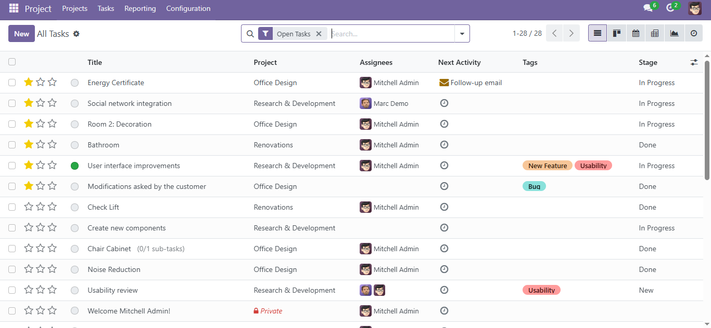
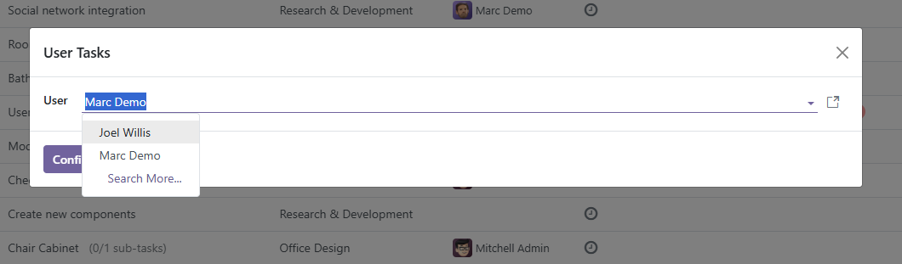

Project Task  
=============

This module extends the functionality of Odoo's ``project`` module by adding a custom menu called **User Tasks**, which provides three specific views to help users and administrators manage tasks more efficiently.

Features
--------

- 📌 **My Tasks**: Displays only the tasks assigned to the currently logged-in user.
- 👁️ **All Tasks**: Available to administrators only. Shows all tasks in the system, along with their statuses and assignees.
- 🔍 **User Tasks**: Allows viewing and editing of a specific user's personal task view.

Menu
----

This module adds a new menu to the system:

.. image:: ./assets/menu.png
   :width: 60%
   :align: center

Usage
-----

#. Navigate to *Projects / Tasks*.
#. Use the side menu options to access:
   - *My Tasks*
   - *All Tasks*
   - *User Tasks*
#. In *User Tasks*, select a user from the wizard to see their active tasks.

Screenshots
-----------

**Main Menu**

.. image:: ./assets/menu.PNG
   :width: 70%
   :align: center

**My Tasks View**

.. image:: ./assets/view_my_tasks.PNG
   :width: 70%
   :align: center

**All Tasks View**

**User Tasks View**

.. image:: ./assets/view_user_tasks.PNG
   :width: 70%
   :align: center

.. image:: ./assets/view_user_selection_tasks.PNG
   :width: 70%
   :align: center

Bug Tracker
-----------

Bugs are tracked on `GitHub Issues <https://github.com/TU_REPOSITORIO_GITHUB/issues>`_.
If you find a bug, please report it with detailed steps to reproduce the issue.

Credits
-------

Authors
~~~~~~~

.. image:: https://d-3system.com.au/wp-content/uploads/2020/05/Dimension3_Systems_460x159.png.webp
   :width: 25%
   :alt: Dimension 3 systems
   :target: https://d-3system.com.au/

Contributors
~~~~~~~~~~~~

* Juan Pablo Arcos

Maintainers
~~~~~~~~~~~

This module is maintained by your team or organization.

.. image:: https://d-3system.com.au/wp-content/uploads/2020/05/Dimension3_Systems_460x159.png.webp
   :width: 25%
   :alt: Dimension 3 systems
   :target: https://d-3system.com.au/

License
=======

Licensed under the LGPL v3.0 or later.  
This module is not part of an official OCA repository but follows OCA best development practices.
